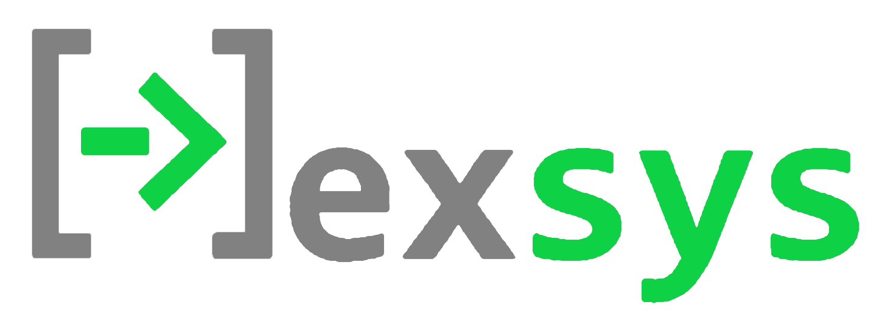

Nexsys is a ⚡blazingly fast🚀(TM) equation solving program written in Rust 🦀. 
Use it locally in your browser of choice thanks to the power of WebAssembly!

The `nexsys-local` repository is home to a simple web-hosted text editor with 
the Nexsys solver engine at its core. Now you can bring your toughest engineering 
design problems to the web and convert units, solve nonlinear equations, and debug 
your math without any installation!

Nexsys is inspired by EES, another equation solving program that is both paid
and closed-source. Nexsys aims to provide a similar level of functionality to EES
with more elegant syntax and an open-source attitude backed by the GPLV3 license.

The nexsys rust crate can be found [here](https://crates.io/crates/nexsys) on crates.io
and can be downloaded as a Rust crate or installed as a cli via `cargo install nexsys`. 
It can also be used in Python by installing via `pip install nexsys`. Of course, you can 
enjoy most features of Nexsys right now over on [github pages](https://forceoverarea.github.io/nexsys-local/).

Like the notepad++ guy says, I hope you enjoy using this software as much as I 
enjoyed writing it!
